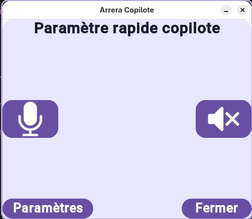
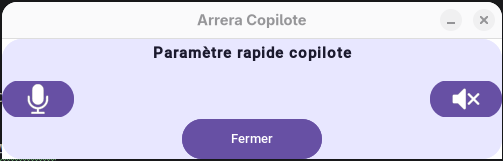
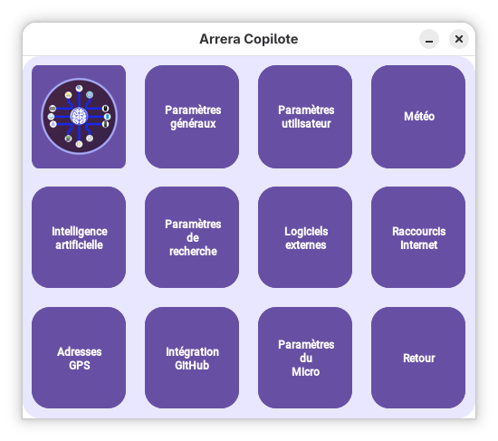

# Documentation d'Arrera Copilote

## Fonctions spécifiques à Copilote

Tout comme Ryley, Arrera Copilote possède 4 modes de fenêtre : 

- *Mode normal* : Mode de fenêtre par défaut dans Arrera Copilote. 
- *Mode petite fenêtre* : Le mode petite fenêtre peut être lancé de deux façons : depuis le bouton à droite de la zone de texte ou en disant "fenêtre réduite".
- *Mode CodeHelp* : Le mode CodeHelp est un mode qui ajoute des boutons pour lancer simplement les outils intégrés à CodeHelp. Il se lance depuis le bouton à gauche de la zone de texte ou en disant "mode CodeHelp" à l'assistant.
- *Mode petite fenêtre CodeHelp* : Fait la même chose que le mode CodeHelp sauf que, dû à la petite fenêtre, les boutons des outils CodeHelp ne sont pas affichés.

## Explication des boutons de la zone de recherche 

L'explication des boutons va de gauche à droite

### Mode normal 

- *Bouton paramètres* : Ouvre les paramètres de Copilote.
- *Bouton CodeHelp* : Passe l'assistant en mode CodeHelp.
- *Bouton petite fenêtre* : Passe l'assistant en mode petite fenêtre (En mode non CodeHelp).
- *Bouton paramètres rapides* : Ouvre les paramètres rapides de Copilote.

### Mode petite fenêtre

- *Bouton paramètres* : Ouvre les paramètres de Copilote.
- *Bouton CodeHelp* : Passe l'assistant en mode CodeHelp petite fenêtre.
- *Bouton fenêtre normale* : Passe l'assistant en mode fenêtre normale.
- *Bouton paramètres rapides* : Ouvre les paramètres rapides de Copilote.

### Mode CodeHelp 

- *Bouton paramètres* : Ouvre les paramètres de Copilote.
- *Bouton Copilote* : Désactive le mode CodeHelp.
- *Bouton petite fenêtre* : Passe l'assistant en mode petite fenêtre CodeHelp.
- *Bouton paramètres rapides* : Ouvre les paramètres rapides de Copilote.

### Mode petite fenêtre CodeHelp

- *Bouton paramètres* : Ouvre les paramètres de Copilote.
- *Bouton Copilote* : Passe en mode normal en petite fenêtre.
- *Bouton fenêtre normale* : Passe l'assistant en mode fenêtre normale CodeHelp.
- *Bouton paramètres rapides* : Ouvre les paramètres rapides de Copilote.

## Explication des paramètres rapides (Quick settings)

### Mode fenêtre normale

- Bouton Micro (Bouton avec le logo de micro) : Active ou désactive le système de trigger word de l'assistant.
- Bouton sons (Bouton avec un logo de haut-parleur) : Active ou désactive la lecture à voix haute de la réponse de l'assistant.
- Bouton Paramètres : Lance les paramètres d'Arrera Copilote.
- Bouton Fermer : Ferme les paramètres rapides.

### Mode petite fenêtre

- Bouton Micro (Bouton avec le logo de micro) : Active ou désactive le système de trigger word de l'assistant.
- Bouton sons (Bouton avec un logo de haut-parleur) : Active ou désactive la lecture à voix haute de la réponse de l'assistant.
- Bouton Fermer : Ferme les paramètres rapides.

## Explication des paramètres

- *Paramètres généraux* : Paramètre qui permet d'ajouter ou supprimer les dossiers d'Arrera Work et Arrera Download
- *Paramètres utilisateur* : Paramètre pour modifier le nom, le prénom et le genre avec lesquels vous souhaitez que votre assistant vous appelle
- *Paramètres météo* : Permet de gérer les villes enregistrées dans le système de météo de l'assistant
- *Intelligence Artificielle* : Permet d'activer ou désactiver l'utilisation de modèles d'intelligence artificielle et de télécharger de nouveaux modèles 
- *Paramètres de recherche* : Paramètre pour changer le moteur de recherche utilisé par l'assistant
- *Logiciels externes* : Permet d'ajouter ou supprimer les logiciels enregistrés dans l'assistant pour qu'il puisse vous les ouvrir 
- *Raccourcis internet* : Permet d'ajouter ou supprimer les raccourcis internet enregistrés dans l'assistant pour qu'il puisse vous les ouvrir 
- *Adresse GPS* : Permet de modifier les adresses de votre lieu de travail et de domicile enregistrées dans l'assistant pour qu'il puisse vous calculer les meilleurs itinéraires
- *Intégration Github* : Permet d'ajouter le token github pour les fonctions de codehelp
- *Paramètres du micro* : Permet d'ajouter les mots de déclenchement de l'assistant et d'activer ou non le son au déclenchement du micro
- *Retour* : Retourne à l'assistant